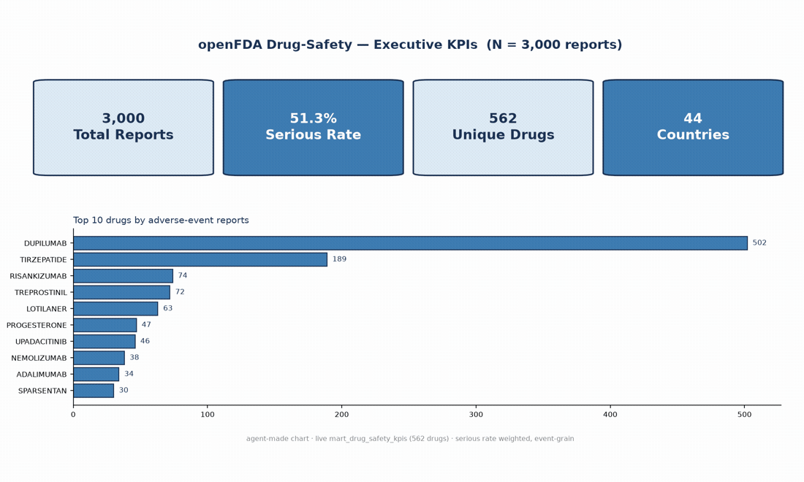
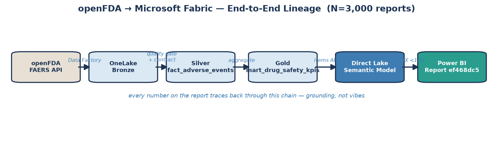
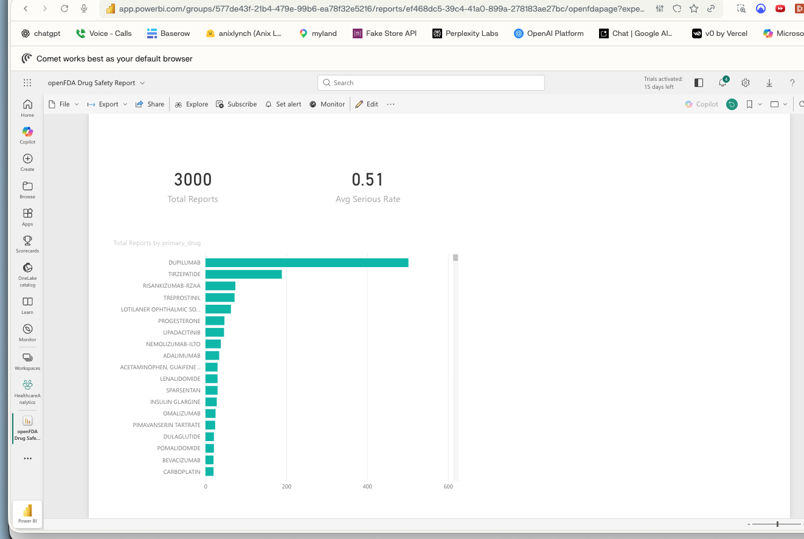
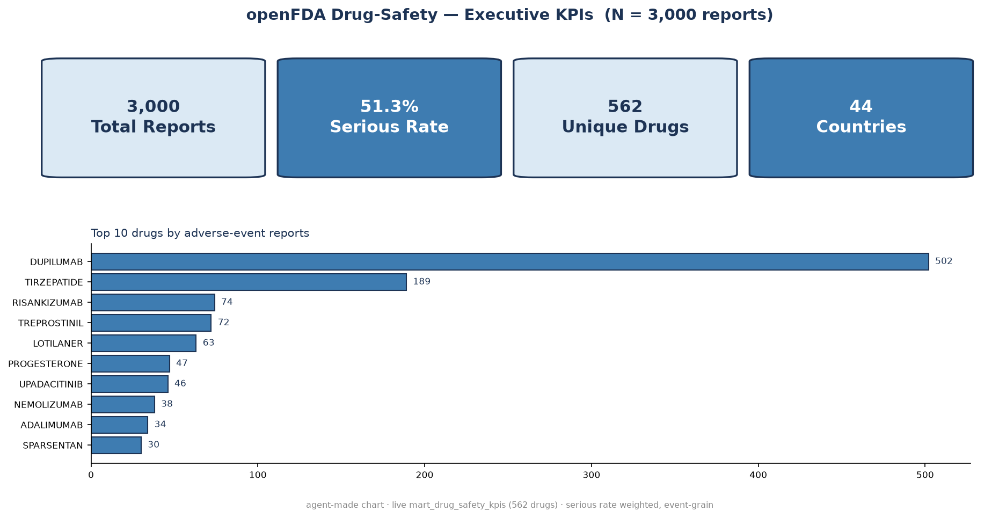
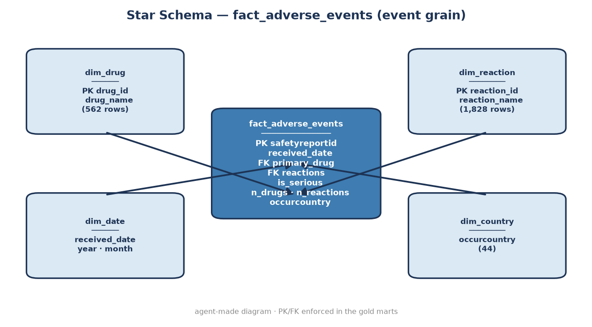

# Healthcare Analytics on Microsoft Fabric — openFDA

> **AI-native Analytics Engineer** · openFDA drug-safety analytics on Microsoft Fabric, built code-first (no GUI).
> Real openFDA FAERS reports land in OneLake as Delta, a Direct Lake semantic model and a Power BI
> report are deployed through the Fabric REST API, DAX runs sub-1.3s, and counts + business metrics
> reconcile against the GCP BigQuery source. The whole BI lane is agent-drivable.


*agent-made walkthrough (matplotlib panels) — not a live Power BI screen-capture*



## What it proves
- **The BI lane ships from code** — semantic model + report (`openFDA Drug Safety Report`, id `ef468dc5`)
  deploy via the Fabric Items API, not manual clicking. The deployed definitions are committed in [`model/`](model/).
- **Sub-second answers** — real DAX through the Power BI engine: warm p50 ~0.5s, all < 1.3s
  ([`proof/dax_latency.json`](proof/dax_latency.json)).
- **Trusted data, not vibes** — null drug-name 14.4% → 0.0% under a versioned contract, schema-drift
  PASS/WARN/FAIL, every number traced through [`proof/lineage.json`](proof/lineage.json).
- **Portable metric layer** — fact + dims + mart counts reconcile GCP ↔ Fabric
  ([`proof/reconcile_gcp_fabric.json`](proof/reconcile_gcp_fabric.json)).

## Numbers (N = 3,000 reports)
| metric | value |
|---|---|
| adverse-event reports | **3,000** (6 monthly partitions × 500) |
| serious rate (event-weighted) | **51.3%** |
| unique drugs | 562 |
| reporting countries | 44 |
| distinct reactions | 1,828 |


*the deployed `openFDA Drug Safety` report — real Power BI, code-deployed via the Fabric Items API*




## The mess it conquers (raw openFDA → trusted)
Real FAERS data is not a clean table — that's the point. Profiled from 3,000 raw reports
([`proof/messiness_report.json`](proof/messiness_report.json)):

| what arrives (the mess) | why it's hard | what the trust layer does |
|---|---|---|
| nested JSON, **6 levels deep** | not flat rows | parse → event-grain `fact_adverse_events` |
| **14.4%** null drug names | naive join drops them | `coalesce(generic_name → medicinalproduct)` → **0%** |
| reactions **1–185 per report** (list-valued) | breaks a flat star | explode into `bridge_report_reaction` (8,232 links) → M2M done right |
| 1.9% missing country · 27-field ragged schema | no fixed shape | nullable dims + versioned contract PASS/WARN/FAIL → quarantine, never silent-drop |

→ 11,523 records, **100% contract-validation pass, 0 violations** downstream. However messy it
arrives, it never contaminates the clean layer.

## Repo map
```
healthcare-da/
├── demo.gif     agent-made walkthrough (panels of the hero diagrams)
├── pipeline/    openFDA → BigQuery → OneLake → semantic model → report → DAX bench → visuals
│   ├── build_openfda_marts.py   openFDA FAERS → BigQuery marts (event-grain contract shape)
│   ├── ingest_to_onelake.py     BigQuery marts → OneLake Delta (Direct Lake source)
│   ├── build_semantic_model.py  Direct Lake semantic model via Fabric Items API
│   ├── deploy_report.py         Power BI report (cards + bar) via Fabric Items API
│   ├── benchmark_dax.py         DAX latency via executeQueries (delegated token)
│   └── build_visuals.py         agent-made diagrams/charts (matplotlib)
├── model/       model.bim (semantic model: fact + dims + relationship + measures) + report.pbir — committed source of truth
├── contracts/   openFDA fact contract + semantic contract (governed measure definitions)
├── proof/       lineage · DAX latency · GCP↔Fabric reconcile · quality · schema-drift receipts
├── images/      agent-made diagrams (lineage · quality gates · star ERD · serving · KPIs)
├── tests/       contract shape + DAX<1.3s + reconcile checks (pytest)
└── README.md
```

## Run
```bash
az login --use-device-code              # delegated token (executeQueries needs a user, not an SP)
python pipeline/build_openfda_marts.py  # openFDA → BigQuery
python pipeline/ingest_to_onelake.py    # BigQuery → OneLake Delta
python pipeline/benchmark_dax.py        # DAX latency → proof/
python pipeline/build_visuals.py        # diagrams → images/
```

## Honesty notes
- Quality gates are **PySpark / notebook-driven**, not Great Expectations.
- The figures in `images/` are **agent-made diagrams** (matplotlib), not Power BI screenshots; the
  Power BI report itself is the deployed `ef468dc5` (definition in `model/report.pbir`). `demo.gif` is
  an agent-made panel walkthrough, not a screen-capture.
- `model/model.bim` is the committed semantic-model definition and the **live deployed** model: the full
  star (mart + fact_adverse_events + dim_drug + dim_reaction + the `fact → dim_drug` relationship) resolves
  in Direct Lake — verified by a cross-table DAX query (top drugs via `dim_drug` × the fact `Reports` measure).
- openFDA is real public FAERS data; serious rate is **event-weighted** (51.3%), not a small-n per-drug average.
- Star schema / dbt / Great Expectations as a *platform* are credited to the sibling `healthcare-ai-data-engineer` (GCP) repo.
