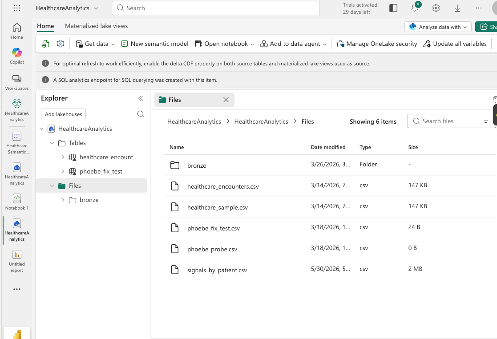
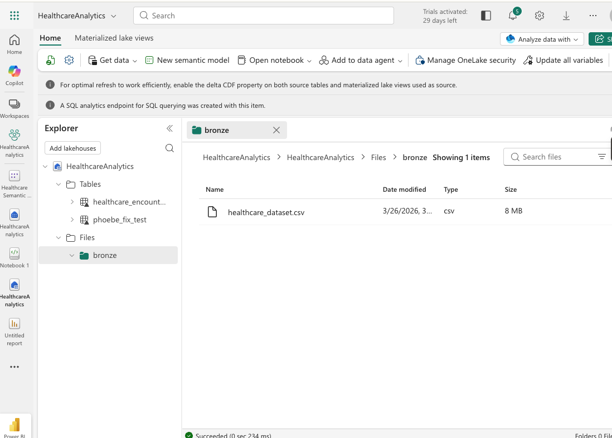
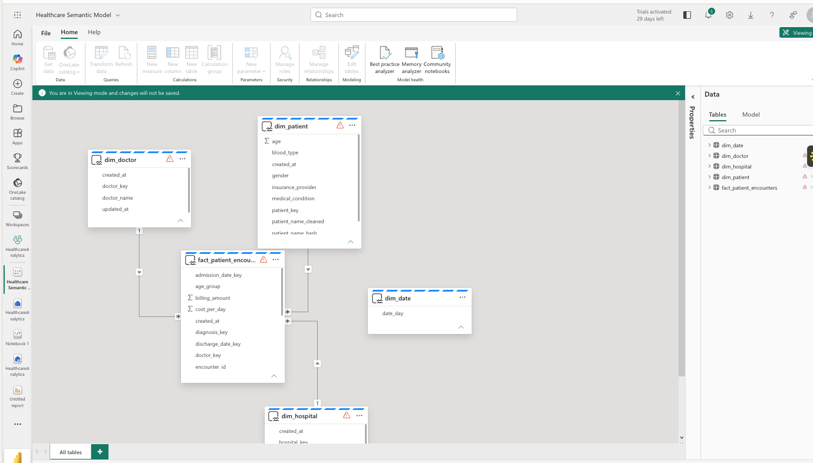
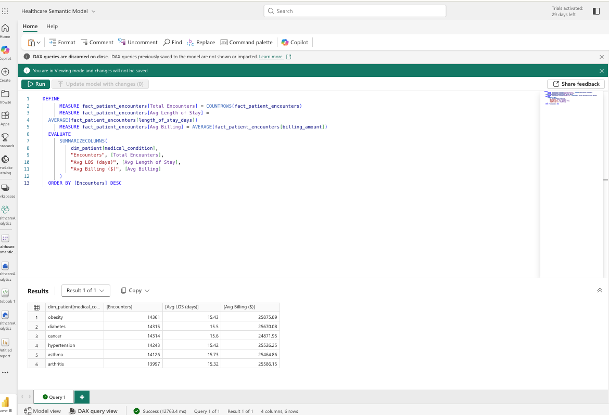
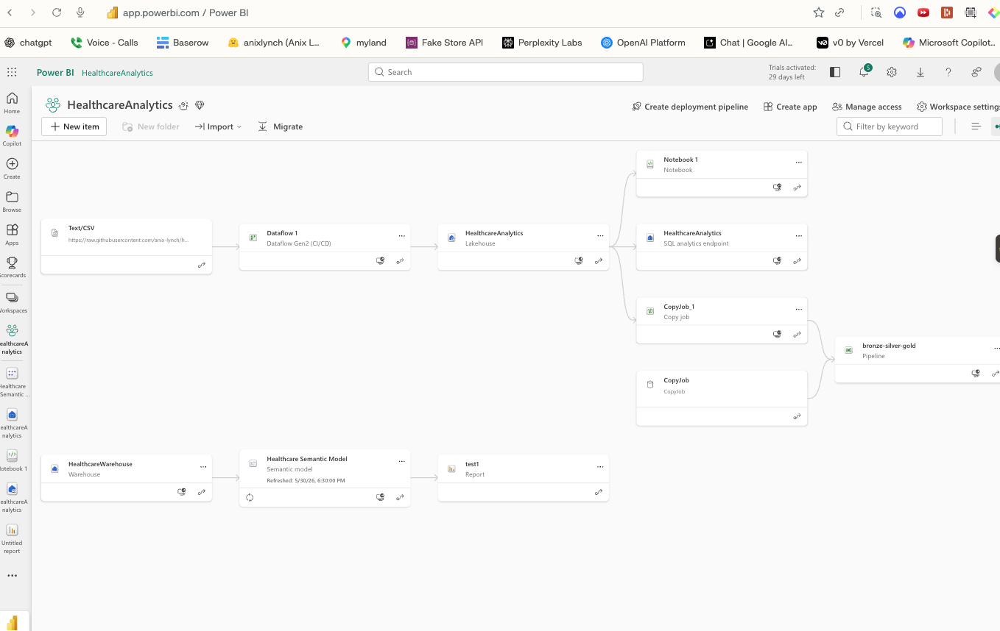
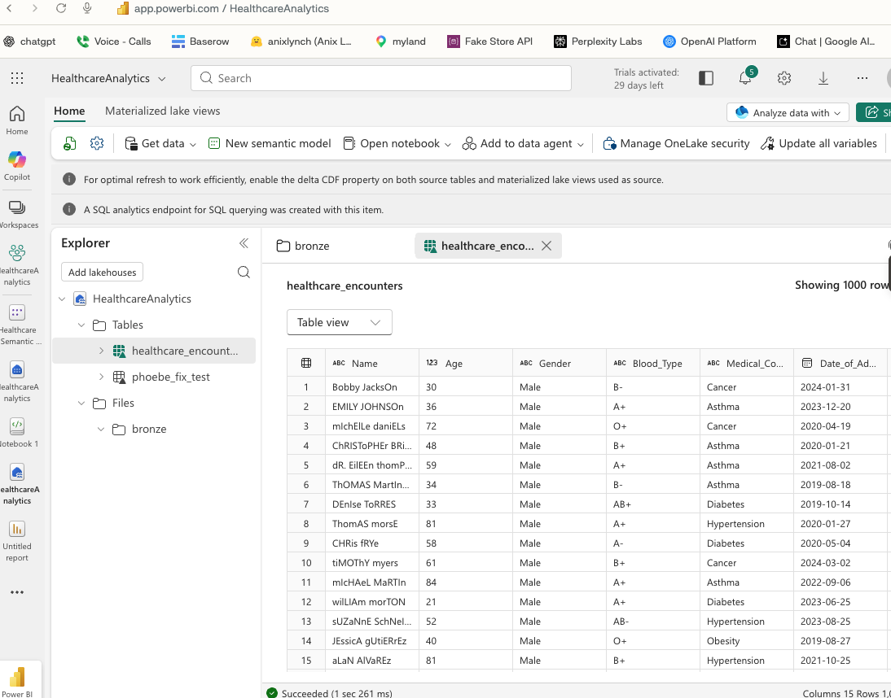

# Healthcare Analytics on Microsoft Fabric

> 🟥 **L1 Truth** — part of the [L1→L3 healthcare AI platform](https://gozeroshot.dev): trusted data → features → signals → agent actions → human adoption. This repo = a Microsoft Fabric medallion warehouse + dbt + semantic model that feeds BI and downstream AI.

**Microsoft Fabric medallion warehouse + dbt + TMDL semantic model + Power BI + REST API**, over 55,500 synthetic patient records.

[](https://gozeroshot.dev/projects/healthcare-analytics-fabric/)

## What it is
A trusted data backbone for hospital operations: raw clinical data → cleaned/conformed marts → a governed semantic model that Power BI and AI agents both consume. The point is **trust** — every metric traces to a dbt test, not a claim.

```
bronze → silver → gold        (dbt medallion in Fabric lakehouse/warehouse)
        → TMDL semantic model (certified measures, version-controlled like code)
        → Power BI             (executive dashboards)
        → REST API             (machine-readable marts for downstream AI)
```

## Highlights
- **dbt star schema** — staging → intermediate → fact + conformed dims, with domain SQL tests gating every build.
- **TMDL semantic model in Git** — measures + relationships reviewed like application code.
- **Microsoft Fabric** — lakehouse + warehouse + SQL endpoint + bronze-silver-gold pipeline (API-verified).
- **MLflow lineage** — training runs logged with metrics (honest AUC on synthetic data).
- **FastAPI** — OpenAPI-documented endpoints serving the gold marts.

## Repo map
```
dbt-project/     medallion models · tests · macros · seeds · snapshots
api/             FastAPI service + OpenAPI snapshot
powerbi-model/   TMDL semantic model (measures, relationships)
ml-pipeline/     MLflow training + lineage
data/raw/        synthetic source data (clearly labeled)
inputs/ outputs/ reproducible fixtures + generated artifacts
scripts/         ingestion / build helpers
screenshots/     Power BI dashboard captures
```

## Data note
All data is **synthetic** (clearly labeled) — no real PHI. Suitable for a public portfolio.

## Live Fabric proof

Captured from the live Microsoft Fabric workspace (synthetic data). The semantic-model
relationships were defined as code (TMDL) and pushed via the Fabric REST API, then rendered
in Model view — code-first, not click-built.

| | |
|---|---|
|  |  |
| Lakehouse Files — data ingested via Dataflow Gen2 | Medallion bronze layer |
|  |  |
| Semantic model — fact→dim star schema (1—∞, FK/PK) | DAX query over the modeled relationships |
|  |  |
| End-to-end lineage: CSV → Dataflow → Lakehouse → semantic model → report | Warehouse table preview |

---
*Part of Anix Lynch's L1→L3 healthcare AI platform — see [gozeroshot.dev](https://gozeroshot.dev). MIT licensed.*
